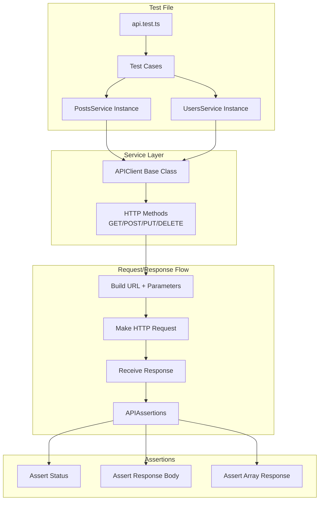
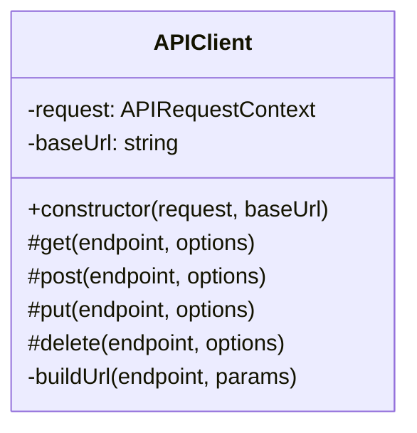
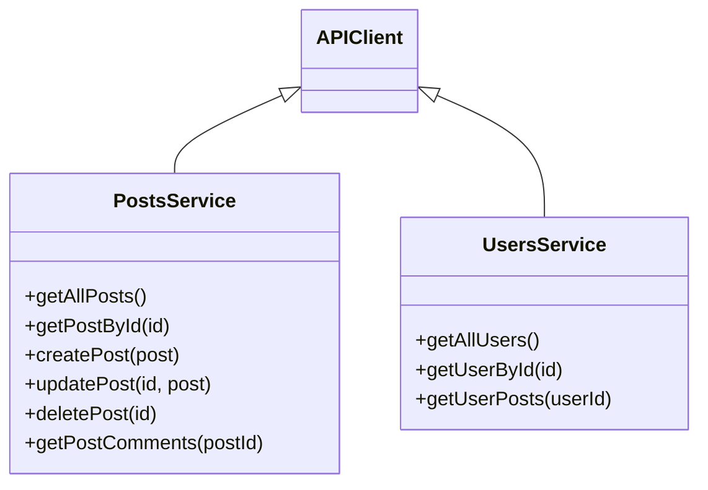
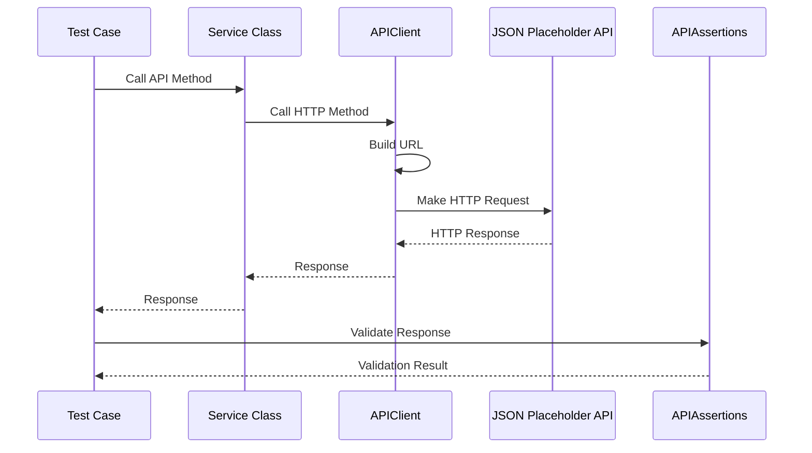

# API Testing Framework Flow Diagram

## Detailed Component Overview

### 1. APIClient (Base Class)

### 2. Service Classes

### 3. Test Execution Flow

## Key Components Description

1. **APIClient (Base Class)**
   - Handles base HTTP operations
   - Manages URL construction
   - Handles common request/response logic

2. **Service Classes**
   - Extend APIClient
   - Provide specific API endpoint methods
   - Handle domain-specific logic

3. **APIAssertions**
   - Provides reusable test assertions
   - Validates response status
   - Validates response body
   - Handles array responses

4. **Test Files**
   - Define test cases
   - Initialize services
   - Execute API calls
   - Validate responses